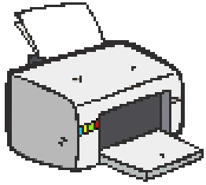
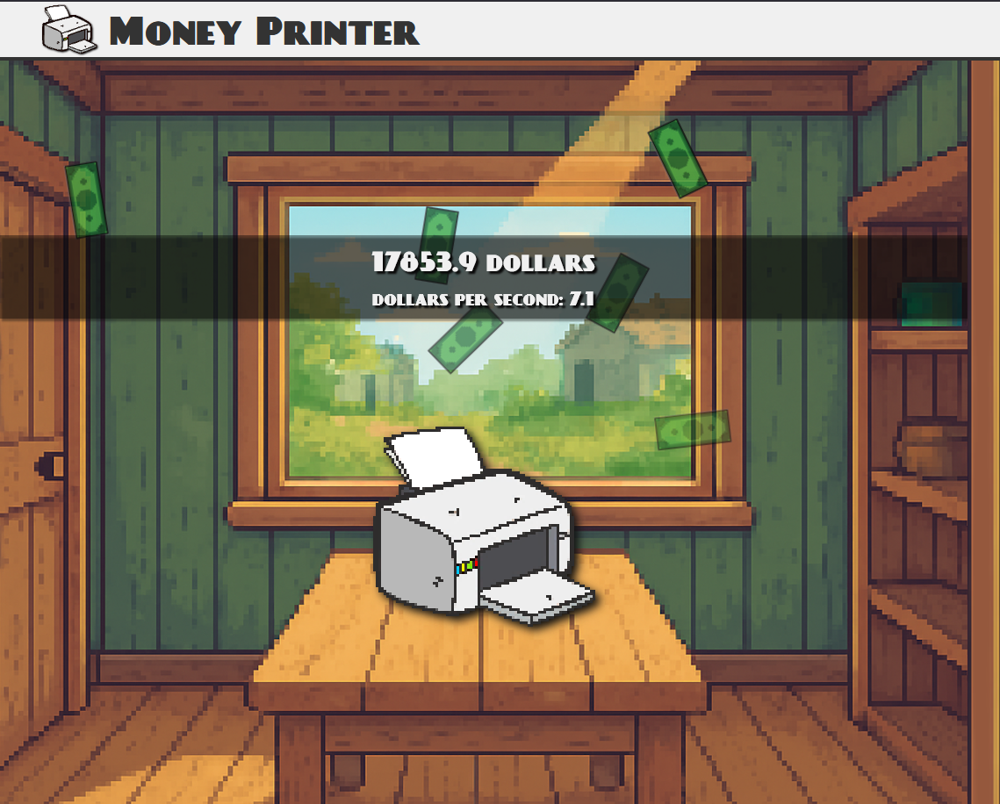
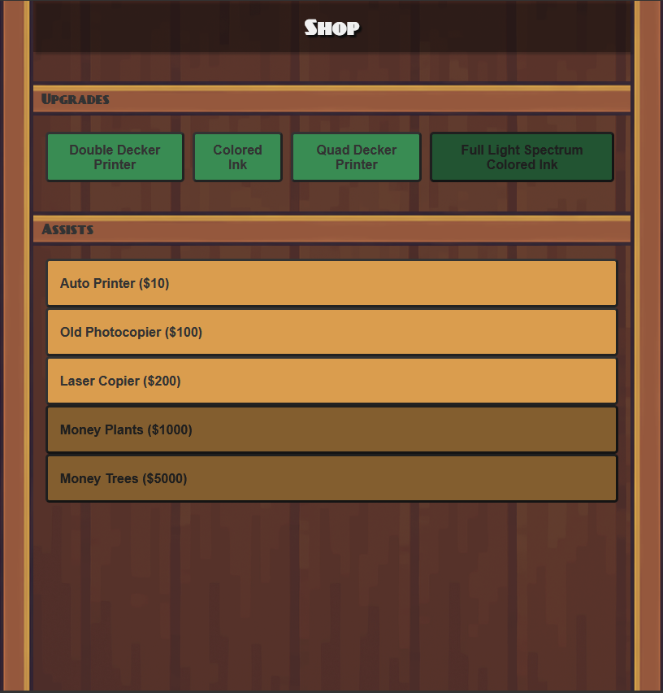

  
  
  

 
 

 

  

<h3 align="center">Money Printer Clicker Idle Game</h3>

  

    Money Printer is an idle-style incremental game made with only HTML, CSS, and JavaScript (no frameworks).
     
    <a href="https://iliyabel.github.io/Money-Printer/"><strong>Visit Site»</strong></a>
    &middot;
    <a href="https://github.com/Iliyabel/Money-Printer"><strong>Explore the docs »</strong></a>
     
     
  

## 🎮 How to Play

 
 

- **Click the printer** to earn dollars.
 
 

 
 

- **Buy assists** to automate your income (dollars per second).
- **Purchase upgrades** to boost your earnings per click or increase your automation rate.
- **Progress is saved automatically** in your browser. You can close and reopen the page and your money, upgrades, and assists will be restored.

## ✨ Features

- **Intro Popup:** The first time you load the game, you'll see an introduction screen. It will not appear again after you click "Got it!".
- **Persistent Progress:** All money, upgrades, and assists are saved using localStorage.
- **Dynamic Shop:** Upgrade and assist buttons are generated from JavaScript objects, so labels and tooltips always match the game logic.
- **Dollars Per Second:** The current automation rate is always displayed and updates live.
- **Responsive UI:** Works in modern browsers and on GitHub Pages.

## 🛣️ Future Plans

- Restart game button.
- Add texture to shop.
- Allow multiple assists of the same type.
- Add more upgrades and assits.
- Add shine around printer.

## 📌 Getting Started

**To run it yourself:**

1. **Clone or download** this repository.
2. Open `index.html` in your browser, or host the folder using a static server (e.g. GitHub Pages).
3. Play!

**Or try it instantly online:**

- [Play Money Printer on GitHub Pages](https://iliyabel.github.io/Money-Printer/)

## 🛠️ Assets

- All images and fonts are in the `resources/` folder.
- Make sure file names and paths are **case-sensitive** if you deploy to GitHub Pages.

## 👥 Credits

- Game by Iliya Belyak
- No frameworks or external libraries used.

---

Enjoy printing money!